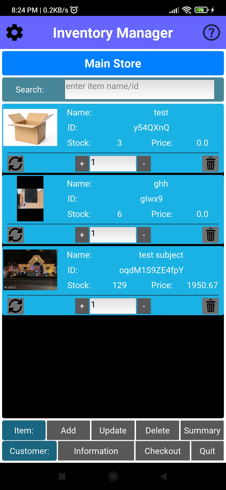
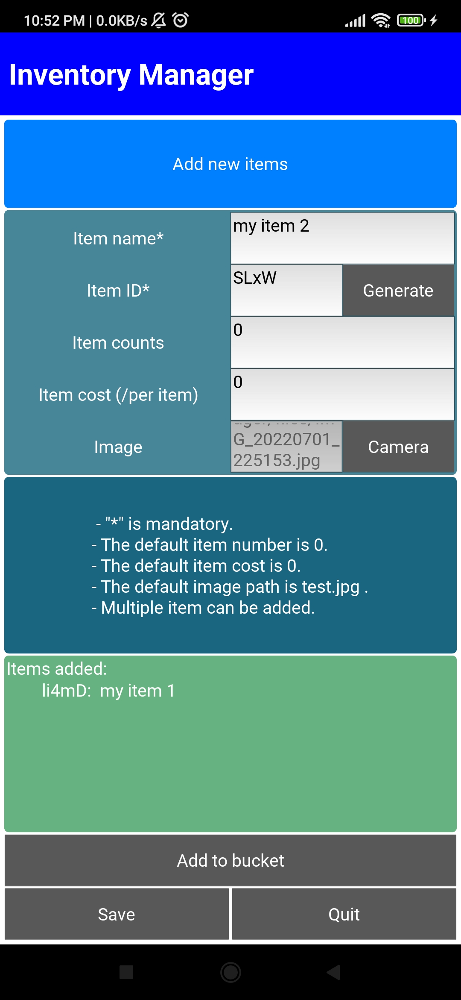
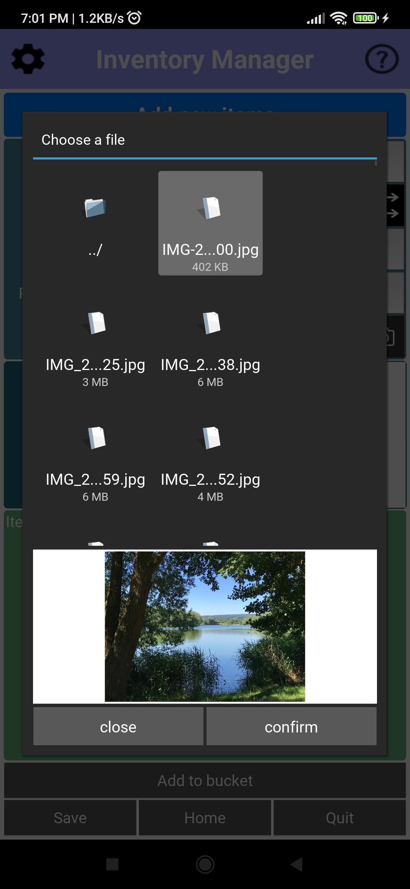
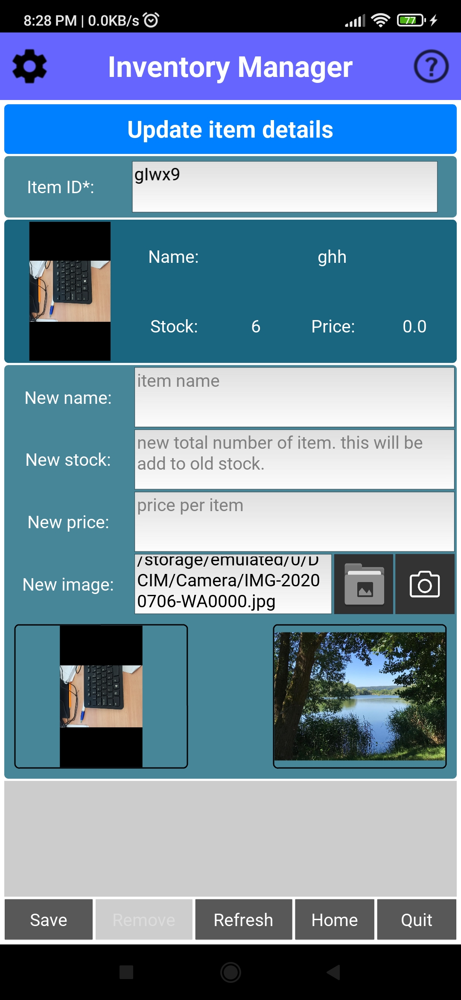

# Inventory-manager-android-app
This is an **android app** for managing your inventory items. The `apk` file is in the `bin/` folder. 

# The `apk` file
* 

# Details
* The app was created with `python kivy` and build using `Buildozer` .
* The app needs additional CAMERA permission to take picture of an item if needed. 
* It creates a `sqlite` database for the items: "StoreData.db"
* Each item has
  * a name
  * `ID`: item id
  * `Count`: number of items
  * `Cost`: cost of an item
 * You can change item counts easily. 
 * You can `Add` or `Delete` or `Update` item (details).
 
# Button details
## Main store
* Here you can change item counts and `Add`, `Update`, or `Delete` an item.
  * **+** : To increase the item count. You can put the number of item you want to change in the text box corresponding to the box next to the `+` symbol. 
  And then click on `+` sign.
  * **-** : To deduct the item count. You can put the number of item you want to change in the text box corresponding to the box next to the `-` symbol. 
  And then click on `-` sign.
  * **Add**: To add new item in the store.
  * **Update**: To update an item details, such as item cost.
  * **Delete**: To delete an item.
  
## Add new items
* Here you can add new item (s). 
  * **Item name** : Name of the new item. This is mandatory.
  * **Item ID** : The unique id of the item. The id shoud be unique. This is mandatory.
  * **Item counts**: Number count of that item. Defauls is 0. If nothing is supplied 0 will be used.
  * **Item cost**: Item cost per item.  Defauls is 0. If nothing is supplied 0 will be used.
  * **Image**: The image for the item. You can add it manually or you can use the camera to `Take picutre`. Defaults 'imgs/test.jpg'.
  * **Take picutre**: To take a picture of the item.
  * **Add to bucket**: After you entry the item details you have to add it to the bucket. It you don't add the item to bucket the item will bot be save. 
  You can add multiple items in the bucket. Each time you add a valid item you will find it in the `Items added` list. 
  * **Save**: Finally save all your items in the bucket.
  * **Quit**: If you want to quit.
  
## Update item window
#### Update item property
* Update the item details such as item cost.
  * **Item ID**: Please enter the `item ID` for which you want to update the details, in the text field next to it. 
  * **Show**: On click you will see the details about the item.
  * **Back**: If you want to go back.
  * **New cost**: Put the new cost in this text field.
  * **Save**: Finally save the update.
  * **Quit**: If you want to quit.
  
#### Delete item
* To delete an item.
  * **Item ID**: Please enter the `item ID` for which you want to update the details, in the text field next to it. 
  * **Show**: On click you will see the details about the item.
  * **Back**: If you want to go back.
  * **Confirm**: To delete click here.
  * **Quit**: If you want to quit.

# Screens
###
    

  
# LICENSE
  The app is under GNU General Public License agreement. It is completely free and open source.
