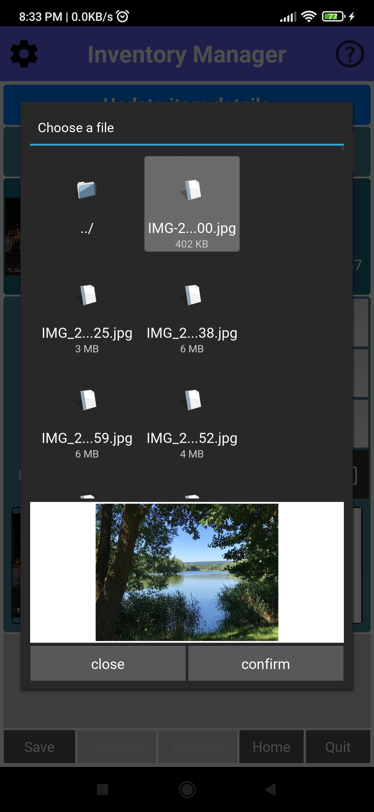
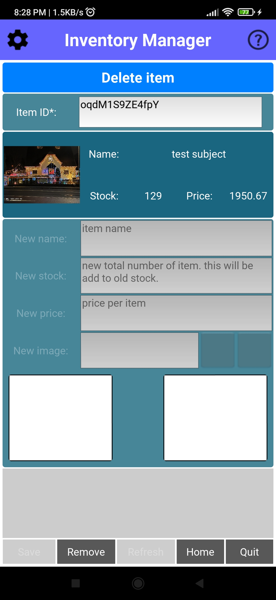
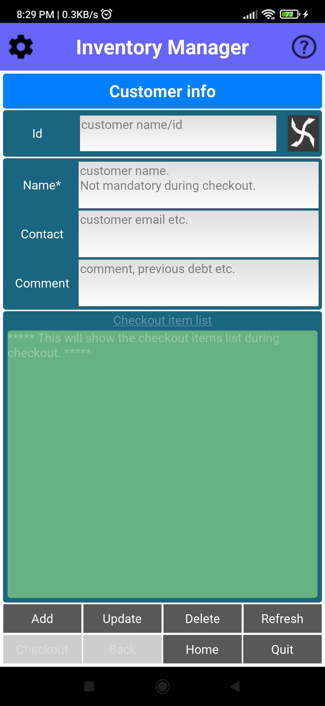

# Inventory-manager-android-app
This is an **android app** for managing your inventory items. The `apk` file is in the `bin/` folder. 

# The `apk` file
* 

# Details
* The app was created with `python kivy` and build using `Buildozer` .
* The app needs additional CAMERA permission to take picture of an item if needed. 
* It creates a `sqlite` database for the items: "StoreData.db"
* Each item has
  * `Name`: a name
  * `ID`: item id
  * `Stock`: number of items
  * `Price`: cost of an item
 * You can change item counts easily. 
 * You can `Add` or `Delete` or `Update` item (details).
 * You can `Print` the summary of the all the items in your stock.
* You can apply the customer check-out.
 * `Information`: To add ot delete or update the customer information.
 * `Check-out`: Customer check-out window. 
 
# Button details
## Main store
* Here you can change item counts and `Add`, `Update`, or `Delete` an item.
  * **Search**: To search an item in the below list.
  * **+** : To increase the item count. You can put the number of item you want to change in the text box next to the `+` symbol. 
  And then click on `+` sign.
  * **-** : To deduct the item count. You can put the number of item you want to change in the text box next to the `-` symbol. 
  And then click on `-` sign.
  * **Arrow**: To update an item details.
  * **Trash**: To delete an item in the store.
  * **Add**: To add new item in the store.
  * **Update**: To update an item details, such as item cost.
  * **Delete**: To delete an item.
  * **Print** : To print the summary of all the items.
  * **Information** : Add/update the customer.
  * **Check-out**: Customer check-out option.
  * **Quit**: To quit the app.
  
## Add new items
* Here you can add new item (s). 
  * **Name** : Name of the new item. This is mandatory.
  * **ID** : The unique id of the item. The id should be unique. This is mandatory. You can also generate random ID.
  * **Arrow**: Generates random ID.
  * **Stock**: Number count of that item. Defauls is 0. If nothing is supplied 0 will be used.
  * **Price (/item)**: Item cost per item.  Defauls is 0. If nothing is supplied 0 will be used.
  * **Image**: The image for the item. You can add it manually or you can use the camera to `Take picutre`. Defaults 'imgs/test.jpg'.
  * **Camera**: To take a picture of the item.
  * **Add to bucket**: After you entry the item details you have to add it to the bucket. Then `Save` it. If you don't add the item to bucket the item can not be save. 
  You can add multiple items in the bucket. Each time you add a valid item, you will find it in the `Items added` list. 
  * **Save**: Finally save all your items in the bucket.
  * **Home**: Go back to home page.
  * **Quit**: To quit the app.
  
## Update item details
* Update the item details such as item name, image and cost.
  * **Item ID**: Please choose the item name or id from the list for which you want to update the details. 
  * **New name**: Put the new name in this text field.
  * **New image**: Put the new image in this text field. or,
  * **Camera**: Take a picture of the item.
  * **New stock**: Put the new stock in this text field. This will be add to old stock. 
  * **New price**: Put the new price in this text field.
  * **Save**: Finally save the update.
  * **Refresh**: Reset the window for new input.
  * **Home**: Go back to home page.
  * **Quit**: To quit the app.
  
## Delete item
* To delete an item.
  * **Item ID**: Please choose the item name or id from the list for which you want to update the details. 
  * **Remove**: To delete the item click here.
  * **Home**: Go back to home page.
  * **Quit**: To quit the app.

## Customer info
* For customer formation.
  * **ID**: Add or generate a random customer identification number. 
  * **Name**: Put the new name in this text field.
  * **Contact**: Put the customer contact in this text field.
  * **Comment**: Put the remarks in this text field. For e.g. previous debt etc. 
  * **Add**: To add new customer information in the database.
  * **Update**: To update the customer details.
  * **Delete**: To delete a customer information from the database.
  * **Refresh**: Reset the window for new input.
  * **Checkout**: To add (not mandatory) customer details in the checkout slip.
  * **Back**: Go back to the previous page for updating the checkout item list.
  * **Home**: Go back to home page.
  * **Quit**: To quit the app.

## Customer checkout
* For customer checkout.
  * **Item ID**: Please choose the item name or id from the list for which you want to update the details. 
  * **Count**: How many items do you want to check-out? This can be negative.
  * **Discount**: The discount percent (per item) on the item cost. The default is 0 %.
  * **Add to bucket**: After you entry the item details you have to add it to the bucket. Then `Save` it. If you don't add the item to bucket the item can not be save. 
  You can add multiple items in the bucket. Each time you add a valid item, you will find it in the `Items added` list. 
  * **Add non-listed item**: To add an item which is not in the database. Or, to add previous debt etc.
  * **Checkout**: Finally save all your items in the bucket. And move to page to add customer information in the checkout.
  * **Refresh**: Reset the window for new input.
  * **Home**: Go back to home page.
  * **Quit**: To quit the app.
  
# Screens
###
    
    
  

  
# LICENSE
  GNU General Public License. It is completely free and open source.
  
# Troubleshooting
1. **App crashes on start**
	* Please enable the camera access for this app in the phone settings. 
